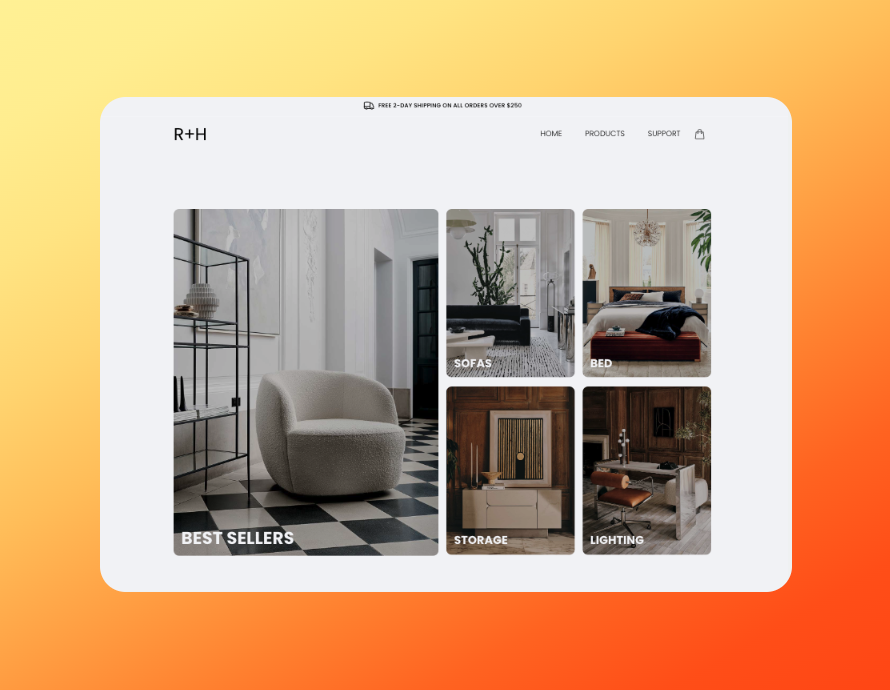

<div align='center'>

# SocialSphere - Social Media App

<!-- Hero -->

<a href="https://rh-furniture.onrender.com/">
	<div align='center'>
  	
  </div>
</a>

</div>

<!-- Hero End -->

<br>

<!-- Tech -->
<div align='center'>


</div>

<br>

<!-- Tech End -->

<!-- Screenshots -->

<div align='center'>




</div>

<br>

<!-- Screenshots End -->

<!-- Overview -->

<div align='center'>

## Overview

</div>

<div align='left'>

Real Home Furniture is a full stack web application built using the MERN (MongoDB, Express, React, and Node.js) stack. The front end of the application is built using React and Redux, and makes use of Axios for API calls and Tailwind CSS for styling. The back end of the application is built using Express, and makes use of Bcrypt for password hashing, Body-Parser for parsing incoming request bodies, Cors for enabling cross-origin resource sharing, Helmet for adding security headers to the application, Jsonwebtoken for generating and verifying JSON web tokens, and Mongoose for interacting with the MongoDB database.

This application is fully responsive and provides a seamless user experience on both desktop and mobile devices. It also offers a range of CRUD endpoints for managing products, categories, and user accounts. In addition, the application includes a Stripe integration for handling payments and creating checkout sessions.

</div>

<!-- Overview End -->

<br>

<!-- Run -->
<div align='center'>

## Run Locally

</div>

<div align='left'>

To clone and run this application, you'll need [Git](https://git-scm.com) and [Node.js](https://nodejs.org/en/download/) (which comes with [npm](http://npmjs.com)) installed on your computer.

From your command line:

```bash
# Clone this repository
$ git clone https://github.com/trdotpy/rh-furniture

# Go into the repository
$ cd rh-furniture

# Install dependencies
$ npm install

# Set environment variables
DATABASE_URL=
PORT=
SECRET=
REACT_APP_API_URL=

# Install dependencies, run server
$ cd server && npm install
$ npm run dev

# Install dependencies, run client
$ cd client && npm install
$ npm start
```

</div>
<!-- Run End -->

<br>

<!-- Contact -->
<div align='center'>

## Contact

<a href="https://trdotpy.dev/">
  
</a>
<a href="https://www.linkedin.com/in/trdotpy/">
  
</a>
<a href="mailto:tanvi.rahman@outlook.com">
  
</a>
</div>

<!-- Contact End -->

<!-- License -->

<div align='center'>

## License

[MIT](https://choosealicense.com/licenses/mit/)

</div>
